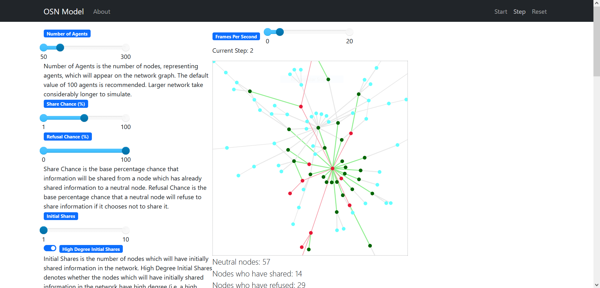
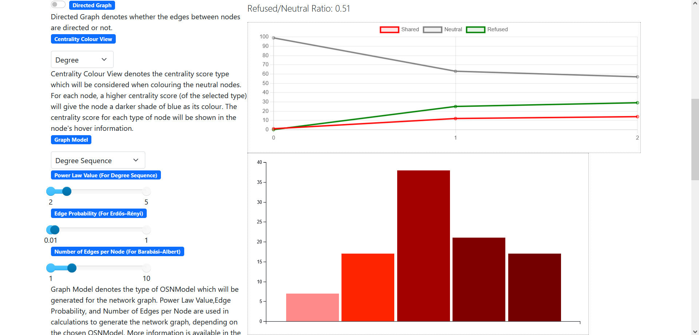
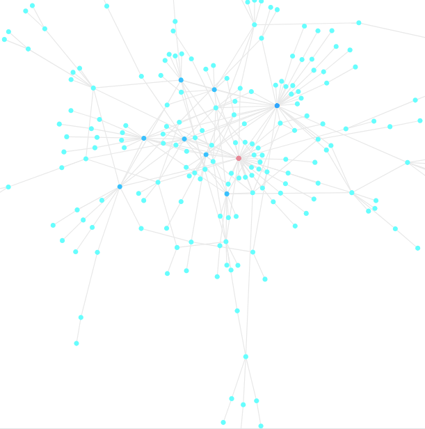
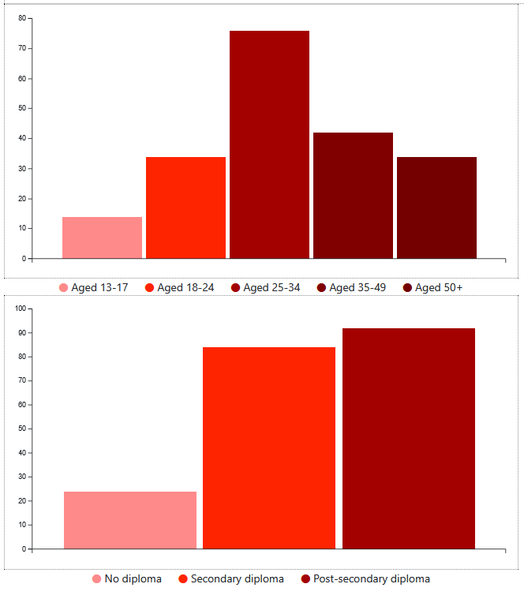
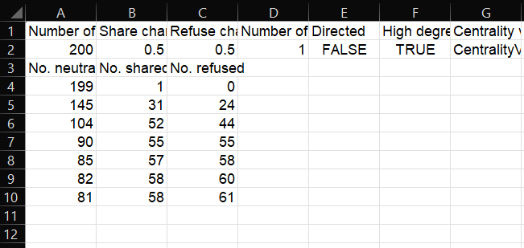

# OSNModel — Online Social Network Information Spread Simulation

OSNModel is an undergraduate agent-based simulation modelling how information (including misinformation) spreads through an **online social network (OSN)**.

The project uses the **Mesa** agent-based modelling framework and represents users as nodes in a network graph. Agents can transition between states such as:

- Neutral  
- Shared  
- Refused  

The simulation exposes configurable parameters via an interactive browser-based UI and supports multiple network generation approaches.

---

## What this project demonstrates
- Agent-based modelling using Mesa  
- Network modelling and analysis with NetworkX  
- Interactive simulation and visualisation  
- Parameter-driven experimentation  
- Exportable data for further analysis  

---

## User Interface & Controls

The simulation is controlled via a browser-based interface provided by Mesa.

### Simulation Controls
Located in the top-right of the interface:
- **Start**/**Stop** — begins/pauses the simulation  
- **Step** — increments the simulation one frame 
- **Reset** — resets the simulation and generates a new network  

---

### Model Parameters
The left-hand panel exposes parameters that influence network structure and agent behaviour, including:

- Population size — number of agents in the network  
- Network generation method — controls how agent connections are created  
- Initial shared nodes — number of agents initially sharing information  
- Probability parameters — influence whether agents share or refuse information  
- Demographic distributions — age and education distributions across agents  
- Intervention parameters — optional settings affecting agent decision-making  

Each parameter includes an in-UI description explaining its effect on the simulation.

---

## Visualisation & Metrics

### Network View
The main graph visualises the online social network:
- Nodes represent agents  
- Edges represent connections between agents  
- Node colour indicates agent state (Neutral / Shared / Refused)  

Below the network view, live metrics summarise the current simulation state:
- Number of neutral agents  
- Number of agents who have shared information  
- Number of agents who have refused information  
- Shared-to-neutral ratio  
- Refused-to-neutral ratio  

These values update dynamically as the simulation progresses.

---

### Time-Series Chart
A line chart tracks how agent states evolve over time, making it possible to observe trends such as rapid information spread or early refusal.

---

### Demographic Distributions
Two bar charts display:
- Age distribution of agents  
- Education level distribution of agents  

These provide additional context for analysing how demographic factors influence information spread.

---

## Running the project locally

### Prerequisites
- Python 3.10+ recommended  
- Windows, macOS, or Linux  

### Setup
From the project root, create a virtual environment:

    python -m venv venv

Activate the virtual environment:

Windows (PowerShell):

    .\venv\Scripts\Activate.ps1

macOS / Linux:

    source venv/bin/activate

Install dependencies:

    pip install -r requirements.txt

Run the simulation server:

    python run.py

Mesa will print a local URL (commonly http://127.0.0.1:8521/).  
Open it in your browser to access the UI.

---

## Mesa version note

This project uses the classic Mesa ModularServer visualisation API, which was changed or removed in newer Mesa releases.

For compatibility and reproducibility, dependencies are pinned to:

- Mesa < 2 (see `requirements.txt`)

---

## Output

Simulation results can be exported to CSV files for further analysis or external visualisation.

---

## Disclaimer

This simulation was created for educational purposes and does not aim to represent real-world misinformation dynamics with clinical or sociological accuracy.
